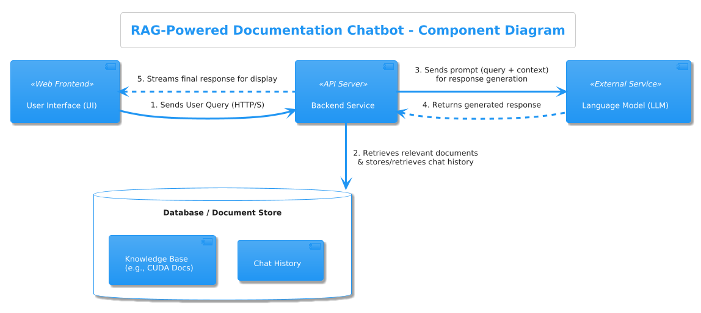

# Capstone Introduction:

Our group decided to use the RAG-Powered Documentation Chatbot suggestion for our capstone AI application. The technical document we chose was the [CUDA C++ Programming Guide.](https://docs.nvidia.com/cuda/cuda-c-programming-guide/index.html), downloaded as a PDF file. We chose this technical document because it represented a dense and specialized reference that requires a contextual awareness from the developer across the document in order to understand how to effectively utilize the hardware. 

CUDA development can present the engineer with a variety of compute hardware (GPU architecture revision) and compute SDK (CUDA version) versions you can access which can make it very difficult to chose the right combination to maximize performance. A RAG Chatbot seemed like the perfect tool to aid for this kind of development.

The goal was to see if the RAG Powered Chatbot could answer questions that range in difficulty from:

- I have an RTX 3090, what version of the CUDA SDK should I target to maximize performance?
- Given the hardware available to me, what is the optimum memory access pattern for my device?
- Given the hardware I have, will dynamic parallelism work in hardware natively or would it fallback on the host?

# Phase 1 - AI as Product Manager (Planning & Requirements)

During phase one and two, we used gemini-2.5-pro to assist with generating documentation

Initially we noticed the assistant was generating feature suggestions for this "first" cut that would be very difficult to achieve in the time given. With some tweaking of the prompt, we were able to steer it towards three simple core features:

 * Answering natural language questions based *exclusively* on the content of the latest stable version of the CUDA C++ Programming Guide.
 * Providing relevant code snippets found within the guide.
 * Citing the specific sections or pages of the guide from which the information was retrieved.

 The AI placed out of scope features in their own section.

 The generated [PRD](../artifacts/prd.md)

# Phase 2 - AI as Architect (Design & Architecture)

During phase two, we asked the AI to generate a PlantUML diagram for a RAG-Powered Documentation Chatbot with the following components:

1. User Interface (UI): The web front-end where users interact with the chatbot.

2. Backend Service (API Server): Handles requests from the UI, processes queries, and coordinates retrieval and response generation.

3. Database or Document Store: Stores the knowledge base (e.g., CUDA documentation) and chat history.



For the ADR, we decided to have the AI generate a report on which database to use for our RAG-Powered Documentation Chatbot. We attempted to steer the AI to use a FAISS based vector database similar to the chatbot example provided in the class but it was very insistent on using Postgres with pgvector. 

The generated [ADR](../artifacts/adr.md)

Note, it wasn't until later that we discovered the note in the capstone mentioning to use SQLite. We attempted to add this as an alternative but still received the recommendation to use PostgresSQL.

Since neither of us where database experts, we went with its recommendation.

# Start of Development Phases

We randomly decided on who would tackle which parts of the application development. 
I was responsible for implementing the backend code while Chad was responsible for the frontend.

Unfortunately for me, I ran into [issues](#back-end-development---attempt-addendum) with my tools and environment that ate up most of my development time with troubleshooting. 
About a quarter through, we decided that Chad would continue working his way towards the backend development tasks as a hedge against my stalled development.

The final code products for the demo are the result of his work as I was only able to fix the issues enough to get the PDF ingested into the database before time ran out. Further work beyond this point was not integrated with his code base.

# Phase 3 - AI as Backend Developer (Coding)

For Backend development, we started loading the schema that we generated to create pydantic model. Then we used the LLM to generate python code for the backend FastAPI application. We needed to do numerous iterations of prompting to get to a working backend service. 

# Phase 4 - AI as QA Engineer (Testing & Security)

For testing, the first step we took was to to generate happy path test function in a python script. After, we generated edge cases where reading document and chat history does not exist. Finally, we asked LLM to generate possible vulnerabilities and saved the artifact 

# Phase 5 - AI as Frontend Developer (UI/UX)

As for the Front end development, we uploaded a sample screenshot to use as initial starting point. We generated the component for the front end app using the screenshot and used the component as a basis to produce other UI parts. Again, in order to get the front end app to load correctly, we needed to have sessions of prompting to get to a working app. In order to stitch everything together, it took us some time go get it to a working state.

---
---
---
---

# [BACK](#phase-3---ai-as-backend-developer-coding)

### Back End Development - Attempt and Issues Addendum
### Context:

- "Web App" full stack development not my forte - don't know what I don't know so leaned on tools much more than and experienced "web app" developer would.
- Ran out of ChatGPT/Copilot Completions / Integrated Code Assist midway through class.
- Switched to gemini chat towards last few days of class, managed to get stuff working but took extra time.
- Used gemini exclusively for capstone, unaware of limitations when more was demanded of it.

# Issue: Limitations Discovered when leaning on Gemini for code assistence:

## Output generation limitations, get truncated output warning:

```
A code sample in this response was truncated because it exceeded the maximum allowable output. Please use the response carefully. You may also try your question again, selecting a smaller block of code as the context.
```

- Inferior integration experience verfsus copilot required tweaking questions to reduce output (i.e. ask for a function example vs a complete python script), unaware of where hard limit was; trial and error experience with tool.

- Attempted to ask to read in and fill in specific code and code stubs for context to not reach output limit. Marginally effective...

### Lack of or Incomplete Awareness of Existing Code in the Project:

Unsuccessful attempts to generate usable code led to major limitations being discovered through experimentation.

- Discovered that gemini chat does not (or may selectively) contain limited context about the project like where files are located or if they even exist. For example, when attempting to combine generated ingest code into the database.py file it generated and stored in app/scripts/, it "hallucinated" the existence of a database.py file at app/database.py that did not exist and recommended deleting it:


- When asked explicitly where the database.py file was located, it claimed it did not exist even thought it just recommended deleting the one located in scripts/:


- I would have to explicitly tell it where stuff was and verify it was not hallucinating by asking it to repeat lines in the code where I put specific comments:


Before I started probing it for this kind of behavior, I found myself ping-ponging back and forth between generating chunks of code and troubleshooting code I didn't write. I was not aware that it was working with incomplete context, and I was unable to effectively judge its output due to lack of experience in this space.

# Issue: VM Dev Environment:

Eventually I figured out what was going on and I was able to generate usable code. I attempted to start working on standing up the AI recommended database: Postgres with pgvector.

I found out that unlike SQLite, Postgres with pgvector does not have a simple "local file" type storage mechanism (at least according to gemini). It recommended using a Postgres docker container to host the database and generated the Dockerfile.

I ran into two main issues that ate up a lot of troubleshooting time:

- Read/Write permissions on HOST machine for the Docker Container:

```
initdb: error: could not change permissions of directory "/var/lib/postgresql/data": Operation not permitted
cuda_assist_db_container  | chmod: changing permissions of '/var/lib/postgresql/data': Operation not permitted
cuda_assist_db_container  | fixing permissions on existing directory /var/lib/postgresql/data ... The files belonging to this database system will be owned by user "postgres".
```

Gemini generated a Dockerfile that used a volume binding within the app/ folder for persistent storage which seemed reasonable. Unfortunately for some reason it was not allowed to write to that directory. I was not able to determine where the permission issue was: Windows Host or Docker Container/file config. I ultimately just told it to store the database within the container to get past that issue.

- Password Authentication Issues with Postgres:

```
psql: FATAL: password authentication failed for user "postgres"
```

This issue took a fair amount of time to troubleshoot as well. I am not a Docker expert but everything that was being generated seemed fine and the app container was launching but refused to allow me to run psql within the shell. Since the Dockerfile was pretty basic, I was at a loss for what could cause password authentication failures. I went so far as to hardcode everything (was having environment load issues anyways) but no luck. I had found a forum post mentioning password encoding issues as a possible cause but could not investigate within the container due to not being able to run psql commands (it did not recognize any user basically).

After talking with Chad and hearing how he installed Postgres on bare metal, I decided to try that as well. Turns out someone already did that on my virtual machine:


Once I found that this was installed, I modified the Dockerfile and code to use a different port and was finally able to login and create the database.

With some last minute work, I think I was able to attempt a relevant query but ran into an input token limitation:

```
{
  "detail": "An internal error occurred: Error code: 429 - {'error': {'message': 'Request too large for gpt-4o in organization org-zfsT8ADSSNe6A8IdWq8ko6iw on tokens per min (TPM): Limit 30000, Requested 632271. The input or output tokens must be reduced in order to run successfully. Visit https://platform.openai.com/account/rate-limits to learn more.', 'type': 'tokens', 'param': None, 'code': 'rate_limit_exceeded'}}"
}
```

In a debug terminal, found hints that it was attempting to pass the chunks to ChatGPT to generate an answer:

```
Given question: What is CONDA?
Retrieved Context: CUDA C++ Pr
Release 12.9
NVIDIA Corporation
Jun 09, 2025
Contents
1
Overview
1
2
What Is the CUDA C Programming
3
3
Introduction
5
3.1
The Benefits of Using GPUs...
```


# [BACK](#phase-3---ai-as-backend-developer-coding)